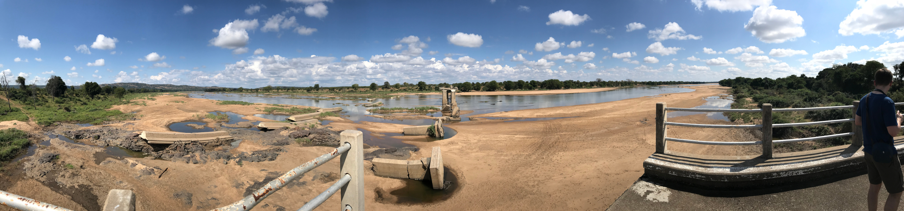
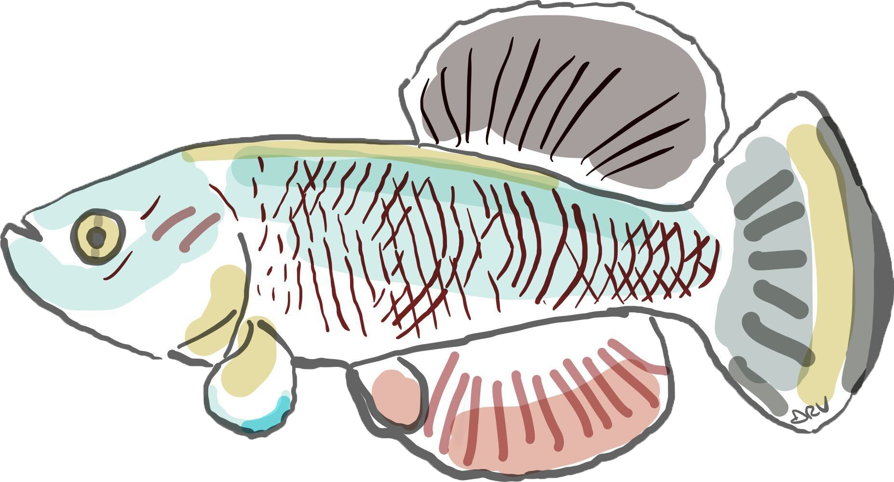
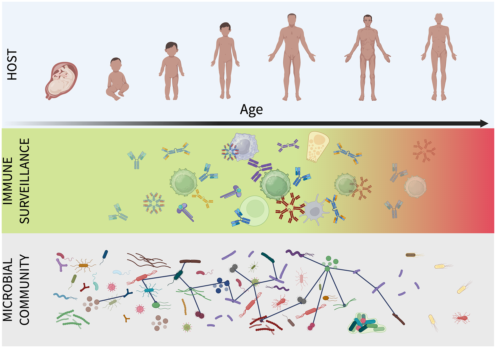
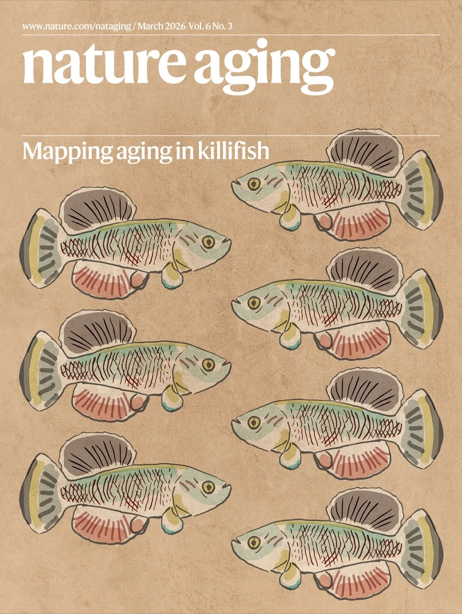
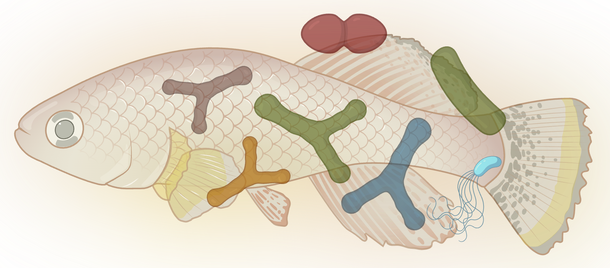
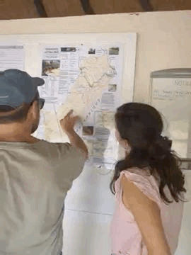

{.hero-image}

We love answering open questions at the intersection of evolution, ecology, and aging.

We investigate how evolution shapes life history traits across species in nature, combining evolutionary theory, comparative genomics, and animal physiology to understand why and how organisms age. We apply an evolutionary and ecological perspective to host-microbiome interactions in health, disease, and aging, and we use statistical modeling, experimental biology, and fieldwork in Zimbabwe to answer open questions and develop interventions that improve biomedical resilience.

If you are interested in joining our lab, see the [openings](join.qmd) page.

---

## Immune aging shapes the microbiome

{width="40%" style="float:right; margin-left:2em; margin-bottom:1em;"}

**May 2026.** Our new Unsolved Mystery in [*PLOS Biology*](https://doi.org/10.1371/journal.pbio.3003815) reframes age-associated dysbiosis. The immune system is an active ecological force shaping microbial community structure throughout adult life, and immunosenescence is a primary driver of late-life microbiome collapse. The aging gut does not simply accumulate the wrong microbes, it loses the capacity to keep the right ones in place.

---

## Evolution shapes the pace of aging

{width="40%" style="float:right; margin-left:2em; margin-bottom:1em;"}

Lifespan varies enormously across species, even among closely related ones. We ask what evolutionary forces produce this variation. We build and test theoretical models of genome evolution in age-structured populations to understand how population size, mutation load, and selection interact to determine when and how fast species age. This framework applies across taxa: from bacteria and flies to vertebrates and humans. Our individual-based simulation platform [AEGIS](https://genome.leibniz-fli.de/aegis/), now published in [*PLoS Computational Biology*](https://doi.org/10.1371/journal.pcbi.1014109), implements these models in a species-agnostic, extensible framework for studying the evolution of life history traits.

## Killifish as a model of vertebrate immune aging

{width="40%" style="float:right; margin-left:2em; margin-bottom:1em;"}

Killifish are a powerful vertebrate model for studying how immunity ages. B cell diversity contracts sharply with age, antibody repertoires narrow, and immune progenitor cells accumulate DNA damage and reduce their repair capacity, driving systemic inflammation. We study how adaptive immunity evolved across killifish species and how somatic mutations accumulate in B cells over a compressed lifespan. By combining single-cell genomics, immunology, and comparative approaches, we can dissect the cellular and molecular basis of immune senescence with a resolution not possible in longer-lived vertebrates. Our multi-omics atlas of killifish immune aging, [KIAMO](https://genome.leibniz-fli.de/shiny/kiamo/), is published in [*Nature Aging*](https://doi.org/10.1038/s43587-026-01086-2).

## Gut microbiome co-evolves with the aging host

{width="40%" style="float:right; margin-left:2em; margin-bottom:1em;"}

The gut microbiome changes dramatically as killifish age, and those changes feed back on host health. We study how hosts select their microbial community across the lifespan, whether commensal microbes evolve within a single host generation, and how shifts in microbial composition affect systemic aging and pathology. We use microbiota transplants, culturomics, and longitudinal metagenomic sequencing to move from correlation to causation in host-microbiome interactions.

## Ecology and Evolution of killifish in nature

{width="27%" style="float:right; margin-left:2em; margin-bottom:1em;"}

Our primary field site is the Gonarezhou National Park in Zimbabwe, which hosts natural populations of turquoise killifish in seasonal pools that evaporate each dry season. We study how demography, ecology, and predation shape killifish evolution in the wild, sampling genetics, gut and environmental microbiota (via eDNA), and aging biomarkers directly from living populations. In collaboration with the Gonarezhou Conservation Trust, we conduct molecular work on site, including Nanopore sequencing directly in the field.
