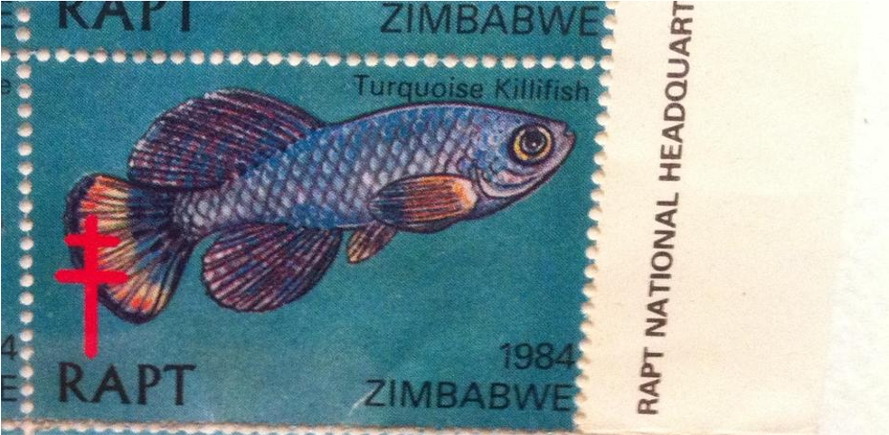
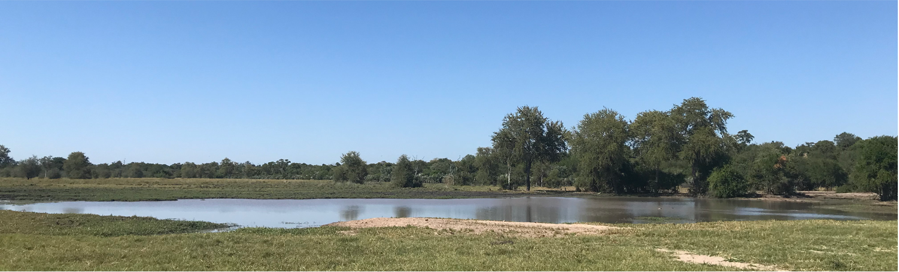

{.hero-image}

We love answering open questions at the intersection of evolution, ecology, and aging.

We investigate how evolution shapes life history traits across species in nature, combining evolutionary theory, comparative genomics, and animal physiology to understand why and how organisms age. We apply an evolutionary and ecological perspective to host-microbiome interactions in health, disease, and aging, and we use statistical modeling, experimental biology, and fieldwork in Zimbabwe to answer open questions and develop interventions that improve biomedical resilience.

If you are interested in joining our lab, see the [openings](join.qmd) page.

---

## Evolution shapes the pace of aging

{width="100%"}

Lifespan varies enormously across species, even among closely related ones. We ask what evolutionary forces produce this variation. We compare killifish populations that differ in natural lifespan, build models of genome evolution in age-structured populations, and test how population size, mutation load, and selection interact to determine when and how fast species age. Our work connects evolutionary theory with the molecular biology of aging, using population genetics, comparative genomics, and individual-based simulations to link genotype to life history across species in nature.

## Gut microbiome co-evolves with the aging host

The gut microbiome changes dramatically as killifish age, and those changes feed back on host health. We study how hosts select their microbial community across the lifespan, whether commensal microbes evolve within a single host generation, and how shifts in microbial composition affect systemic aging and pathology. We use germ-free fish, microbiota transplants, culturomics, and longitudinal metagenomic sequencing to move from correlation to causation in host-microbiome interactions.

## Immune aging reshapes microbial communities

B cell diversity contracts sharply with age in killifish, mirroring immune aging in mammals. We study the adaptive immune system at the intersection of aging and ecology: how antibody repertoires evolved across killifish species, how somatic mutations accumulate in B cells over time, and how immune senescence shifts gut microbiome composition. We combine immunology, genomics, and comparative approaches to understand why immune-microbiome balance breaks down with age and how that breakdown accelerates aging.

## Field ecology in Gonarezhou

{width="100%"}

Our primary field site is the Gonarezhou National Park in Zimbabwe, which hosts natural populations of turquoise killifish in seasonal pools that evaporate each dry season. We study how demography, ecology, and predation shape killifish evolution in the wild, sampling genetics, gut microbiota, and aging biomarkers directly from living populations. Field observations constrain and motivate our laboratory models; laboratory findings guide what we measure next in the field.
