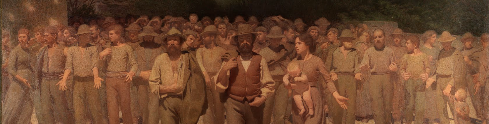

We are a team of international scientists working to answer open questions in evolutionary biology of aging and microbiome research.

## Senior Scientist

<figure class="person">
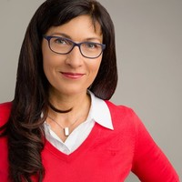
**Kathrin Reichwald** manages the Valenzano lab, from animal licences, to group coordination and support of scientific projects.
</figure>

<figure class="person">
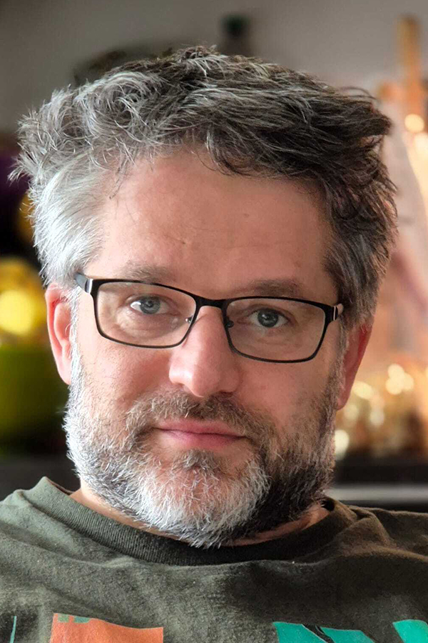
**[Paulius Grigaravicius](pgrigaravicius.qmd)** is a biophysicist with expertise in cytometry and imaging in the context of genomic instability. His work is aimed at molecular phenotyping of killifish pre-clinical models.
</figure>

## Research Engineer

<figure class="person">
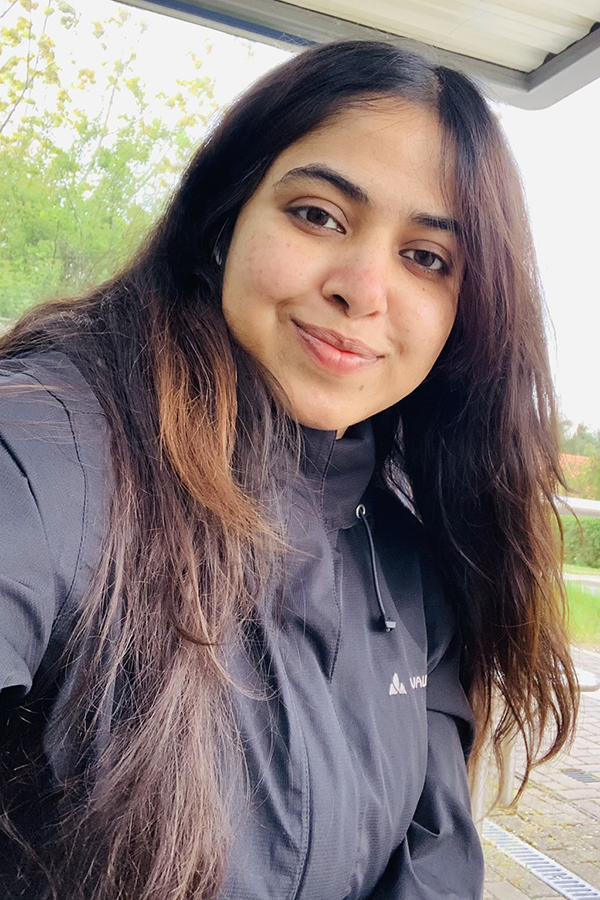
**Farzana Shamim-Schulze** isolates and cultures our killifish-derived microbial isolates. Farzana works on the puzzling role of phages in microbes isolated from young and old killifish.
</figure>

## Lab Technicians

<figure class="person">
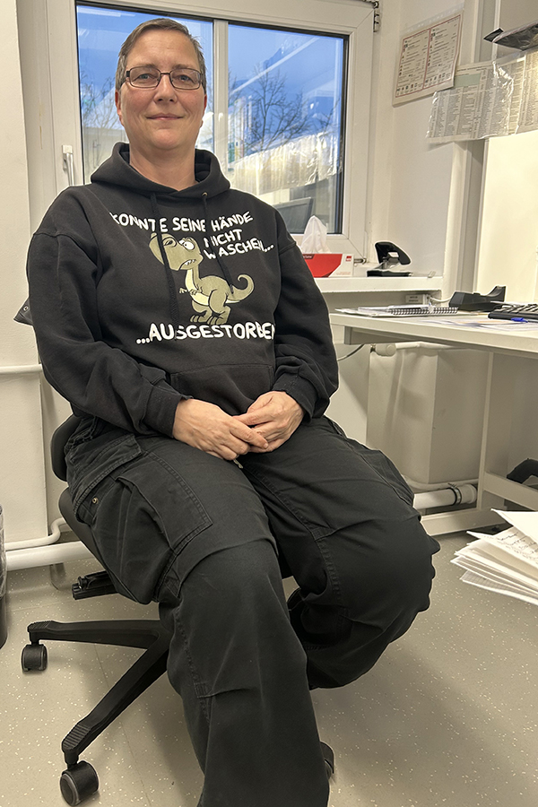
**Ivonne Heinze** is supporting projects revolving around genomics, molecular cloning, and general lab organization.
</figure>

<figure class="person">
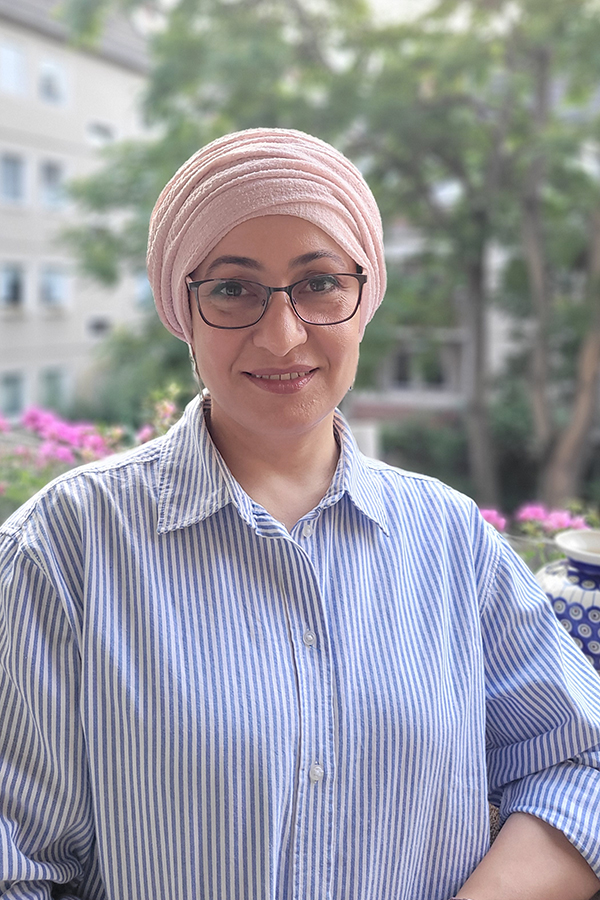
**Shaymaa Azawi** is our killifish transgenic expert and helps generate killifish lines as pre-clinical models of neurodegenerative diseases, with a special focus on ALS.
</figure>

## Postdocs

<figure class="person">
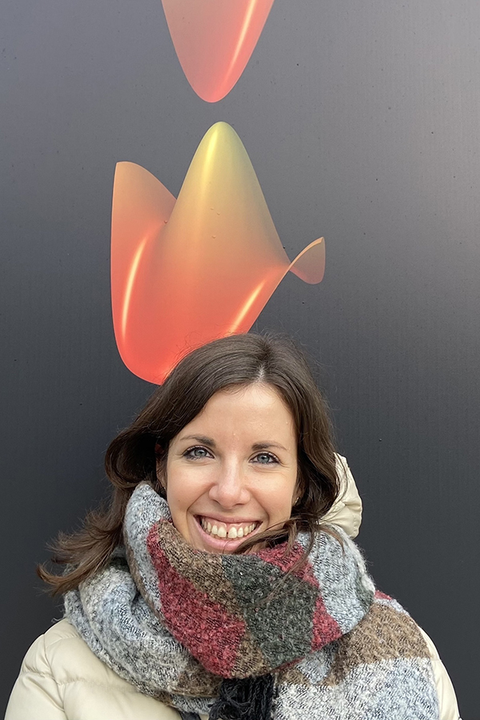
**[Silvia Cattelan](scattelan.qmd)** studies male reproductive aging in turquoise killifish. Silvia is an experimental biologist performing experiments in captive killifish cohorts.
</figure>

<figure class="person">
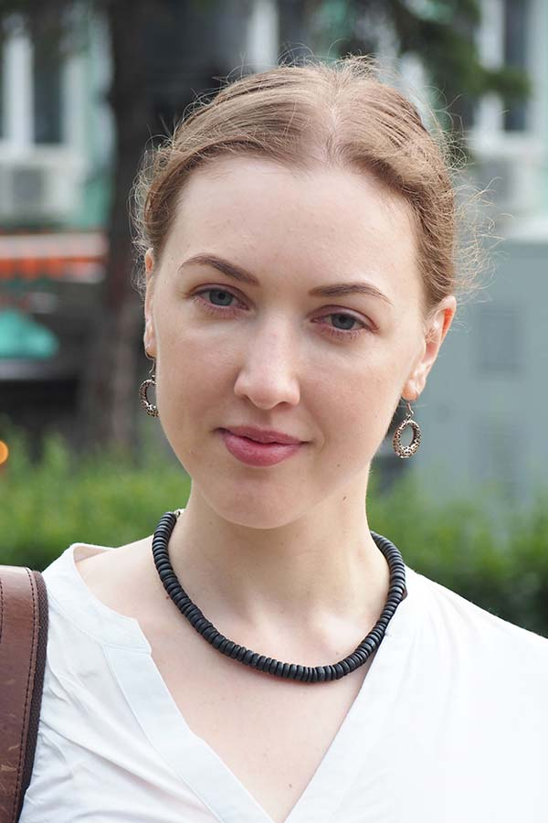
**[Alina Ryabova](aryabova.qmd)** studies immune aging in killifish. Alina is an experimental biologist using omics technologies to understand co-evolution between gut microbiome and immune system during aging.
</figure>

<figure class="person">
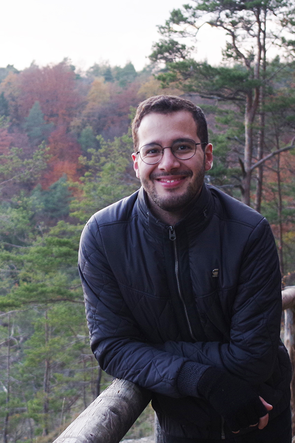
**[Flávio Costa](fcosta.qmd)** is a microbiologist and his work unravels the interaction between the gut microbiome and aging in turquoise killifish.
</figure>

<figure class="person">
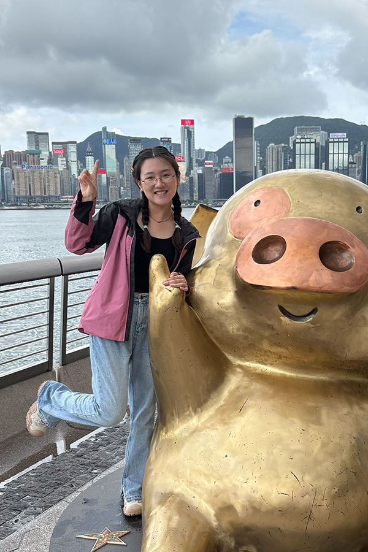
**[Siqi Liu](sliu.qmd)** is a microbiologist with a focus on microbial genomics and evolution.
</figure>

<figure class="person">
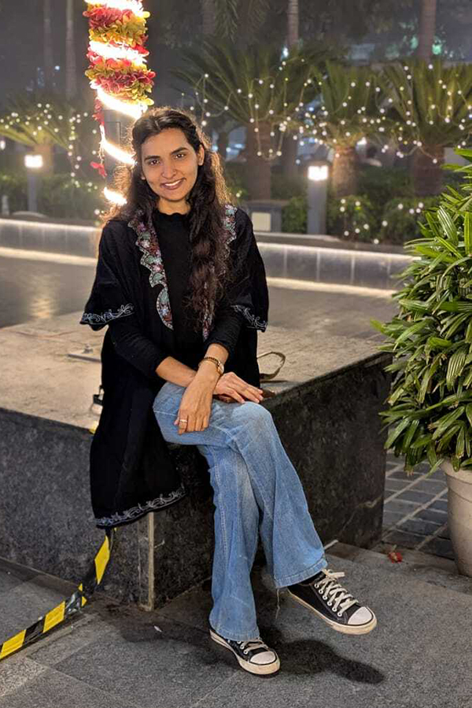
**[Priti Malik Devi](pdevi.qmd)** studies the impact of infection and infectious diseases on the microbiome.
</figure>

<figure class="person">
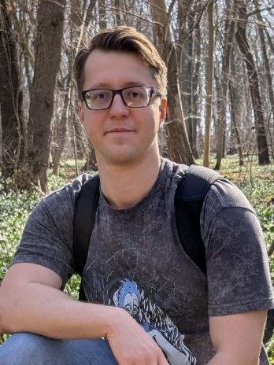
**[Kanstantsin Siniuk](ksiniuk.qmd)** is a molecular biologist with a medical background, interested in how DNA damage repair interacts with transcription and metabolism in the pathophysiology of aging and age-related rare familial syndromes, like amyotrophic lateral sclerosis (ALS).
</figure>

## Graduate Students

<figure class="person">
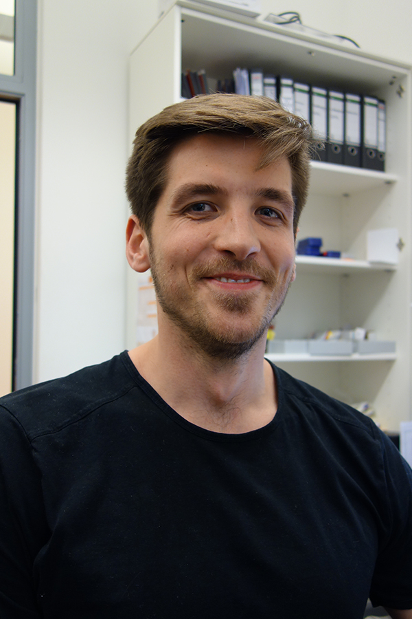
**Jens Seidel** is interested in the interplay between immune aging and microbiome composition in killifish and mice. He develops molecular methods to study how the host immune system shapes the commensal microbiome. Jens' work involves molecular biology, genome editing, and genomics.
</figure>

<figure class="person">
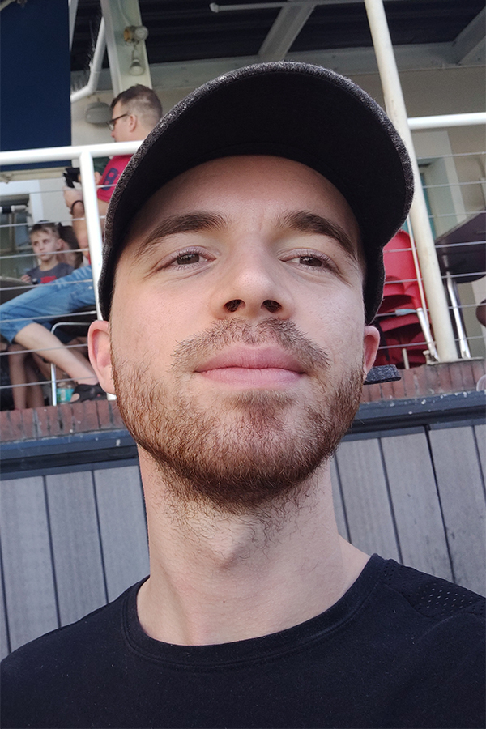
**Martin Bagic** develops numerical models of genome evolution, exploring how demography and ecology shape the evolution of genetic variants that cause aging across species in nature.
</figure>

<figure class="person">
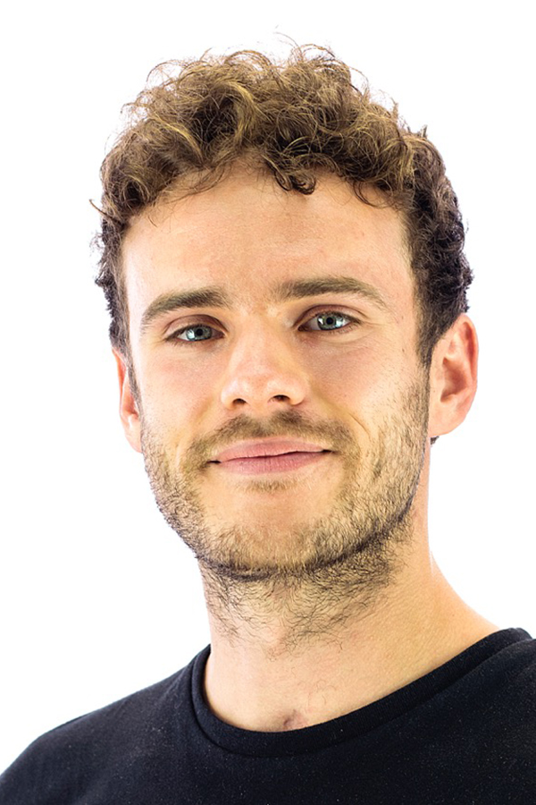
**Sam Kean** studies how microbiota establish themselves, persist, and change in composition throughout host life. Sam's work involves fieldwork, genomics, bioinformatics, and microbiology.
</figure>

<figure class="person">
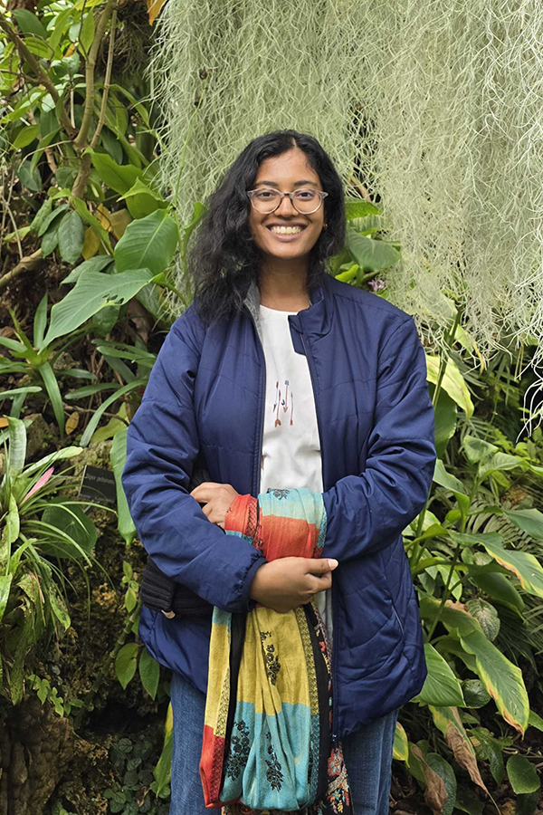
**Ruchitha Byrohalli** studies how wild killifish populations adapt to their environment, exploring the role of hybridization in adaptation, speciation, and aging.
</figure>
