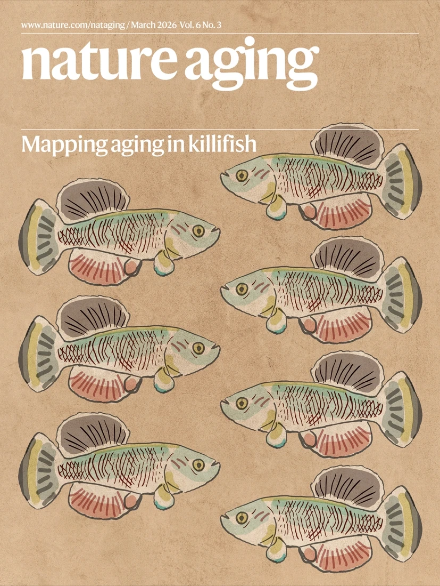

Our paper, "Spontaneous aging-associated inflammation and genome instability in the immune system of turquoise killifish," is the cover article of the March 2026 issue of *Nature Aging*.

The study, led by Gabriele Morabito together with Handan Melike Dönertas, Lorenzo Sperti, Joachim Seidel, Armin Poursadegh Zonouzi, and Miriam Poeschla, documents how the killifish immune system ages spontaneously and rapidly. Without any experimental intervention, old fish accumulate systemic inflammation, fibrosis in kidney marrow (the teleost equivalent of bone marrow), and DNA double-strand breaks in immune progenitor cells with reduced repair capacity. Functionally, immune cells from old fish respond significantly less to bacterial stimulation.

The paper also introduces KIAMO, a public multi-omics database of killifish immune aging, and shows that senolytic treatment partially restores youthful immune responses in aged cells, implicating senescent cells as active drivers of immune decline.

The full paper is open access: [Morabito et al., *Nat Aging* 6, 665–681 (2026)](https://doi.org/10.1038/s43587-026-01086-2).
