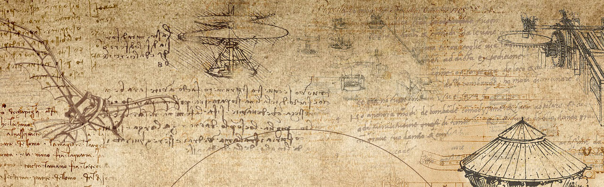
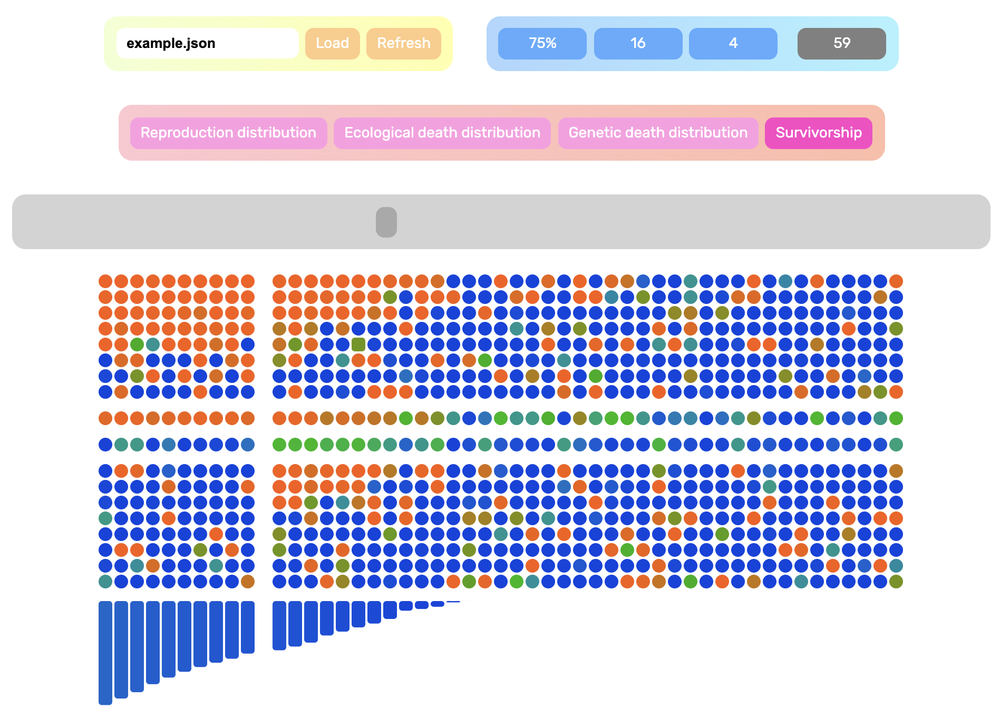
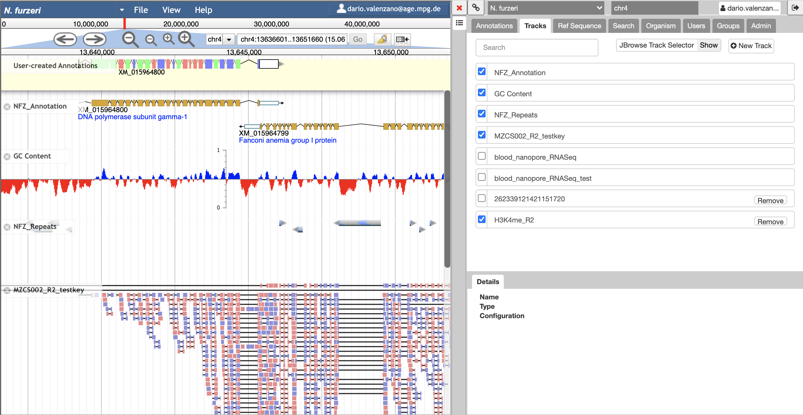

Working on a [non-canonical model organism](https://doi.org/10.15252/embj.201796837) requires building new tools. We develop and share what we make.

## AEGIS

We created **[AEGIS](https://github.com/valenzano-lab/aegis)** as a versatile in silico tool to simulate life history trait evolution. AEGIS employs an agent-based genetic algorithm and allows testing how survivorship and aging evolve in response to varying mutation rates, population size, selection regimes, sexual or asexual reproduction, and more. AEGIS helps visualize and test the extent to which longer or shorter lifespan evolves following a set of well-defined starting conditions, and helps correct our intuition about the evolutionary forces that shape lifespan and aging across species. AEGIS is free and open source.

{width="600px" fig-align="center"}

## Killifish Genome Browser

Our **[Killifish Genome Browser](http://apollo.scinet.fli-leibniz.de/)** provides access to the genomes of *Nothobranchius furzeri*, *Nothobranchius orthonotus*, *Aphyosemion australe*, *Callopanchax toddi*, and *Pachypanchax playfairii*.

{width="600px" fig-align="center"}
